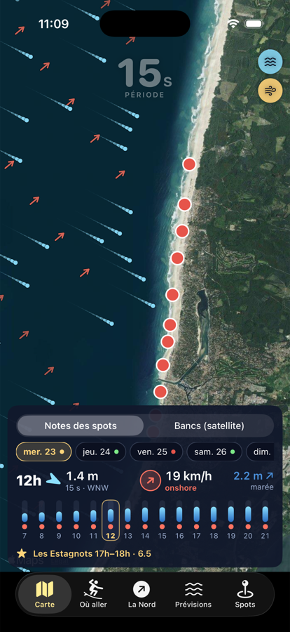
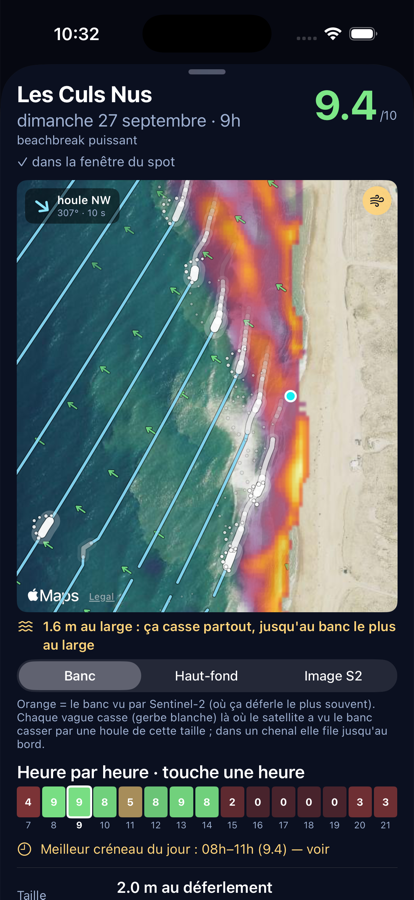
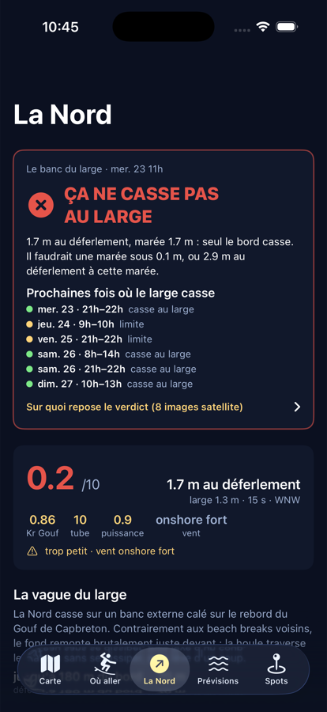
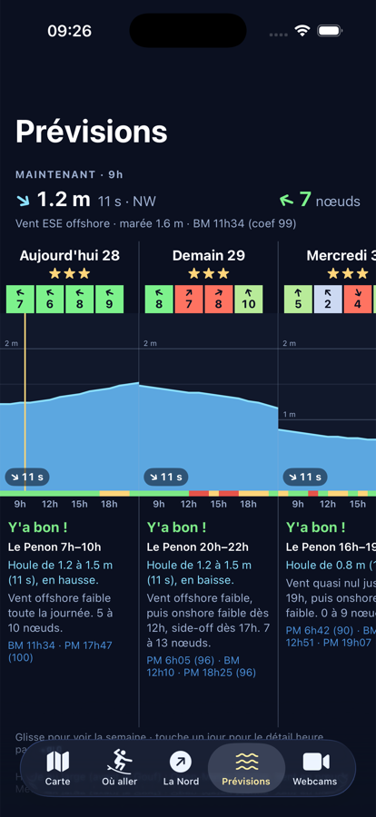

# App Surf — bancs de sable landais vus par satellite

Où surfer demain entre Seignosse et Capbreton ? L'app croise **les bancs de sable vus par
Sentinel-2**, les **prévisions houle / vent / marée** et **la réfraction du Gouf de Capbreton**
pour donner une note sur 10 et un indice tube par spot, heure par heure, sur 7 jours.

<p>
  
  
  
  
</p>

Pipeline Python (numpy, rasterio, STAC) → JSON/PNG → app iOS native (SwiftUI, MapKit, Swift Charts)
et viewer web (Leaflet, PWA). Données : Copernicus Sentinel-2 (AWS Earth Search), Open-Meteo,
bathymétrie EMODnet.

```zsh
python3 -m venv .venv && .venv/bin/pip install -r requirements.txt
./update.sh                 # premier calcul (quelques minutes), crée output/
ios/build_sim.sh            # app iOS dans le simulateur (Xcode + xcodegen)
```

Cartographie des bancs de sable entre Seignosse et Capbreton à partir des images
Sentinel-2 (10 m, un passage tous les 2–3 jours, publié 5–10 h après l'acquisition).
Usage perso. Étape 1 du projet ; les prévisions de houle viendront ensuite.

## Lancer

```zsh
./update.sh              # tout : nouvelles scènes, composite, prévisions, notation, viewer
.venv/bin/python -m sandbanks score      # notation seule (prévisions fraîches, ~5 s)
./update.sh --jours 90   # fenêtre plus longue
.venv/bin/python -m sandbanks scenes   # liste les scènes disponibles / en cache
open output/index.html   # la carte (Leaflet, fond Esri, nécessite internet pour le fond)
```

Une mise à jour prend ~20 s par nouvelle scène (lecture fenêtrée des COG sur AWS, sans compte).
Les scènes sont mises en cache dans `cache/scenes/` (~12 Mo chacune).

## Comment ça marche

1. **Recherche** ([sandbanks/stac.py](sandbanks/stac.py)) — catalogue STAC Earth Search (miroir AWS
   des Sentinel-2 L2A), tuile 30TXP, filtre nuages grossier.
2. **Lecture** ([sandbanks/scene.py](sandbanks/scene.py)) — bandes B02/B03/B04/B08 à 10 m, B11 (SWIR)
   et SCL à 20 m, uniquement sur la bande côtière ; grille UTM 30N native, alignée au pixel.
3. **Détection** ([sandbanks/analyse.py](sandbanks/analyse.py))
   - *Écume de déferlement* = pixel brillant (visible > 0,12) **et** ratio SWIR/visible < 0,5.
     Les bulles absorbent le SWIR : l'écume est à 0,1–0,2, les nuages et le sable sec à > 0,7.
     C'est ce qui permet d'ignorer les petits cumulus que la classification ESA rate.
   - *Nuages* = brillant et SWIR/visible > 0,5, dilaté de 3 px. La classification ESA (SCL)
     n'est utilisée que pour ombres / cirrus / nodata, car elle classe l'écume en « nuage » ou « neige ».
   - *Zone de surf* = pixels mouillés (NDWI > 0) dans ≥ 10 % des scènes, rattachés à l'océan,
     à moins de 1 200 m du bord.
   - Une scène est rejetée si > 25 % de nuages sur la zone, ou ignorée pour les bancs si < 0,5 %
     d'écume (mer d'huile : rien à apprendre).
4. **Composite** — pondération par la récence (demi-vie 20 j) sur une fenêtre de 60 j :
   - `frequence_deferlement` : fraction pondérée des scènes où le pixel casse.
   - `haut_fond` : la fraction d'écume d'une scène sert de proxy de taille de houle ; un pixel
     qui casse déjà sur la scène la plus calme = crête de banc (1), un pixel qui ne casse que sur
     la plus agitée = chenal (~0). Résolution = nombre de scènes utilisées, s'affine avec le temps.
   - `timex` : brillance moyenne (analogue des images timex des caméras Argus).
5. **Rendu** ([sandbanks/rendu.py](sandbanks/rendu.py)) — GeoTIFF UTM (`output/*.tif`, réutilisables
   dans QGIS), PNG reprojetés WGS84 pour Leaflet, une planche par spot (`output/spots/`), une
   image + masque d'écume par scène (`output/scenes/`) pour le curseur temporel du viewer.

## Lecture des résultats

- **Curseur temporel** : la source la plus fiable. On voit où ça cassait à chaque date et
  comment le motif bouge. Passage vers 13h10 heure locale ; la marée du moment n'est pas encore
  prise en compte (à venir), donc comparer deux dates avec prudence.
- **Fréquence** : la barre interne (100–150 m) casse presque toujours → saturée ; l'information
  est dans la **limite externe** (motif en croissant = barres rythmiques et baïnes) et les trous
  (chenaux).
- **Haut-fond** : jaune/vert = banc, violet = chenal/profond.
- **Largeur de la zone de déferlement par spot** (médiane / max / σ le long de la côte) :
  σ élevé = côte rythmique (pics et chenaux), σ faible = barre linéaire (tendance close-out).

## Réglages

Tout est dans [config/zone.yaml](config/zone.yaml) : bbox, seuils de détection, fenêtre et
demi-vie du composite, coordonnées des spots (approximatives, à corriger sur le terrain).

## Limites connues / prochaines étapes

- La marée au passage est connue mais pas encore *utilisée* pour normaliser les composites
  (ex. séparer barre intertidale vue à marée basse / barre externe) : à faire quand il y aura
  assez de scènes.
- Pas de bathymétrie : on voit *où ça casse*, pas la profondeur. Pistes V2 : inversion par
  célérité (S2Shores), Sentinel-1 radar les jours nuageux, webcam perso.
- Bouée CANDHIS Anglet (mesure temps réel) non branchée : servira à corriger le biais de la
  prévision au moment du scoring.

## Conditions et prévisions ([sandbanks/meteo.py](sandbanks/meteo.py))

Tout vient d'**Open-Meteo** (gratuit, sans clé, passé et futur) :
- Marine : houle (hauteur, période, direction, swell / mer du vent) au point « large » 43,66 N / −1,60 W,
  en amont du Gouf ; **niveau de la mer avec marée** (`sea_level_height_msl`).
- Forecast : vent 10 m à Hossegor (modèle Météo-France sur la France).

Le niveau de mer Open-Meteo a été validé contre le SHOM (marnage 1,43 vs 1,49 m le 21/09, cycle
vive-eau/morte-eau correct). Deux calibrations déduites des prédictions SHOM Capbreton :
**zéro hydro = niveau moyen − 2,40 m** et **coefficient ≈ 28,4 × marnage − 13** (±1 sur 4 jours).
Le portail gratuit du SHOM a un endpoint JSON (`marees_shom()`), mais ses clés tournent et un WAF
bloque vite : gardé en option, jamais requis.

- `meteo.enrichir_scenes()` (appelé par `update`) ajoute à chaque scène en cache les conditions au
  passage : houle, vent, hauteur d'eau / zéro hydro, tendance, coefficient. Le composite
  « haut-fond » classe désormais les scènes par houle réelle.
- `meteo.previsions()` écrit `output/previsions.json` (7 j horaires + PM/BM avec coefficients),
  affiché dans le viewer (houle / vent coloré offshore-onshore / marée).

## Le Gouf de Capbreton — effet calculé, pas supposé

```zsh
.venv/bin/python -m sandbanks gouf              # ~4 min : tracé de rayons complet + figures
.venv/bin/python -m sandbanks gouf --rendu-seul # figures/tables depuis data/gouf_Kr.npz
```

Module [sandbanks/gouf.py](sandbanks/gouf.py). Bathymétrie EMODnet (115 m) dans `data/`,
reprojetée UTM 100 m. Pour chaque période (8–20 s) et provenance (240–320°), tracé de ~1 900
rayons (théorie linéaire, RK4, arrêt à l'isobathe 10 m) sur la bathymétrie réelle **et** sur une
bathymétrie de référence « plateau landais sans canyon » (profil cross-shore médian mesuré au
nord). Le rapport des densités de rayons à la côte donne **Kr = H avec Gouf / H sans Gouf**.
Le **Kr effectif** intègre un spectre réaliste (±12° de direction, ±2 s) : c'est lui qu'utilise
le scoring (`gouf.kr_spot(K, spot, T, dir)`), tables dans `output/gouf/gouf_spots.json`.

### Ce que ça donne

- **Ombre au-dessus de l'axe** (La Sud, Le Prévent) : Kr 0,1–0,6, d'autant plus marqué que la
  période est longue. Confirmé sur Sentinel-2 le 19/09/2026 (2,4 m, 12 s, NW) : aucun
  déferlement au large sur 1,7 km entre Le Prévent et La Nord.
- **Lobe nord** : Kr 1,2–1,5 pour les houles longues de NW (300–320°) sur Gravière / Culs Nus,
  La Nord à sa bordure sud (Kr ≈ 1,0–1,1 par NW, en ombre par W/SW long). Position incertaine
  à ±500 m (résolution bathy + coordonnées des spots).
- **Lobe sud** : Santocha / La Piste, Kr 1,3–1,9 pour les houles longues de W/SW (250–270°).
- **Houle courte (≤ 8–10 s)** : effet quasi nul partout.

### La Nord : pourquoi « plus grosse et plus puissante »

Pas d'abord par focalisation : par **le profil d'approche**. L'isobathe 20 m est à 540 m du
bord à La Nord (1 700–2 400 m ailleurs), la 50 m à 1,5 km (5–8 km ailleurs). Pente 20→10 m :
**5,6 %** à La Nord contre ~1 % sur les autres beach breaks.
- La houle traverse le plateau sans dissipation ni pré-déferlement : par gros swell, elle
  arrive intacte là où les autres spots sont déjà une bouillie blanche → « plus grosse ».
- Shoaling brutal (20 m → 5 m en 250 m), façon reef : Iribarren ×5 → déferlement plongeant
  d'un bloc → « plus puissante », tubulaire.
- Le banc du large est calé sur le rebord du canyon : quasi-fixe, d'où la fiabilité du spot.
  Vu sur Sentinel-2 le 19/09 : déferlement jusqu'à 450 m du bord, de La Nord à +700 m nord.
- Par houle longue de NW s'ajoute un léger gain de réfraction (Kr 1,0–1,1) ; par houle longue
  d'W/SW, La Nord est en bordure d'ombre — c'est alors le sud (Santocha) qui prend.

### Limites

- La théorie des rayons exagère les ombres (pas de diffraction) : plancher raisonnable Kr ≈ 0,4.
- EMODnet est grossier sous 10 m : tout ce qui est plus près du bord relève du satellite.
- Les coordonnées des spots pilotent la lecture des lobes : le banc du large de La Nord observé
  suggère que `la_nord` est ~300 m trop au sud dans `config/zone.yaml`.

## Notation des spots ([sandbanks/scoring.py](sandbanks/scoring.py))

Pour chaque spot et chaque heure de prévision (`output/scoring.json`, panneau « Où aller ? » et
heatmap dans le viewer) :

**Chaîne physique** — H au large (Open-Meteo, avant le Gouf) × **Kr effectif** (réfraction du Gouf,
plancher 0,4) × protection des digues → H à l'isobathe 10 m → **shoaling linéaire** jusqu'au
déferlement (H_b = 0,78 h_b) → `H_b`, la taille au déferlement. La période compte : 2 m / 12 s
→ ~2,6 m, 2 m / 6 s → ~2,1 m. **Puissance** = H_b² T normalisé (1,0 = 2 m / 12 s).
**Type de déferlement** = Iribarren ξ0 = pente_banc / √(H/L0) : < 0,4 « mou » (glissant), 0,4–2 « creux » (plongeant).

**Note /10** = 10 × f_taille × f_vent × f_marée × (0,4 + 0,6 f_période) × (0,5 + 0,5 f_direction) × f_banc
- `f_taille` : trapèze sur H_b avec la fenêtre du spot (`taille` dans `zone.yaml`) — 0 quand ça ferme.
- `f_vent` : la côte fait face à **281°** ; offshore = provenance **E / ENE (101°)**.
  E–NE–SE ≤ 25 km/h → 1,0 ; offshore soutenu → 0,85 ; > 35 km/h (spray) → 0,6 ;
  NNE/SSE side-off → 0,9 ; N/S side-shore → 0,75→0,3 selon force ; **onshore (NW/W/SW)** ≤ 10 km/h → 0,6,
  ≤ 20 → 0,3, au-delà → 0,1 ; < 6 km/h glassy → 0,95. La brise thermique NW d'après-midi est le tueur n°1.
- `f_marée` : fenêtre par spot en position de cycle (0 = BM, 1 = PM) : Gravière / Piste / Culs Nus /
  Casernes basse → mi ; La Nord et Prévent mi → haute ; le reste mi.
- `f_période` : trapèze 4–10–17–22 s. `f_direction` : idéal W–WNW 265–300°, OK 250–320°.
- `f_banc` : satellite — σ alongshore ≥ 45 m (bancs rythmiques) ×1,08 ; < 25 m (barre linéaire) ×0,9 ;
  zone de surf < 50 m ×0,85 ; > 250 m (dissipative) ×0,95.

**Indice tube /100** = f_ξ (ξ 0,45 → 0,3 … ξ ≥ 0,9 → 1) × période × vent × marée × taille utile.
Contrôle sur 1,8 m / 12 s / 290° offshore, marée basse-mi : Gravière 100, Piste 100, Culs Nus 73,
Estagnots 68, La Nord 51 (trop petit pour elle), Penon 10.

Chaque case explique son facteur limitant (« trop gros / ferme », « vent onshore », « mauvaise
marée »…). Tous les paramètres par spot sont dans `config/zone.yaml` : c'est là qu'on calibre
avec le vécu terrain.

### Ce qui n'est pas (encore) dans la note
- La foule. La qualité fine du banc (position du pic) : le satellite dit « il y a des bancs
  rythmiques », pas « le pic est devant le poste 3 ».
- Le biais du modèle de houle : brancher la bouée CANDHIS Anglet pour corriger H en temps réel.
- Le vent est pris à un point (Hossegor) ; par vent de N/S les abris locaux (digues) diffèrent.

## Données hébergées (sans le Mac)

Le workflow [.github/workflows/donnees.yml](.github/workflows/donnees.yml) relance
`sandbanks update` + `gouf --rendu-seul` **chaque heure** sur GitHub Actions (scènes Sentinel-2
gardées dans le cache Actions, ~1 min par passage) et publie `output/` sur
**https://ucheyrou.github.io/bancs-surf/**. L'app iOS lit cette adresse par défaut et recharge à
chaque retour au premier plan ; la PWA s'y installe directement. Les prévisions couvrent donc
toujours J‑1 → J+7. Relance manuelle : `gh workflow run donnees.yml`. GitHub suspend les
tâches planifiées d'un dépôt public sans commit depuis 60 jours : il suffit alors de le réactiver
dans l'onglet Actions.

## Sur l'iPhone

Le viewer est une web-app : sur téléphone il passe en onglets (Carte · Où aller · Prévisions ·
Spots · Scènes) et s'installe sur l'écran d'accueil (plein écran, icône).

Le plus simple : ouvrir https://ucheyrou.github.io/bancs-surf/ dans Safari. Pour tester le
pipeline local avant de pousser :

```zsh
./serve.sh        # sert output/ sur le réseau et affiche les adresses à ouvrir dans Safari
```

- **Avec un câble** : sur l'iPhone, Réglages → Partage de connexion → activé, brancher l'USB ;
  le Mac obtient une interface « iPhone USB » et `serve.sh` affiche son adresse (172.20.10.x).
- **Sans câble** : même Wi‑Fi, ouvrir l'adresse Wi‑Fi affichée (ou `http://<nom-du-mac>.local:8765/`).
- Safari → Partager → **Sur l'écran d'accueil**. L'app se lance ensuite en plein écran.

Carte : mode **Notes des spots** (marqueurs colorés par note à l'heure choisie, sélecteur jour /
heure, fiche détaillée au tap : taille, type de déferlement, tube, puissance, vent, marée, Kr Gouf,
créneau du jour, planche satellite) et mode **Bancs (satellite)** (scènes date par date).
Liens directs : `index.html?spot=la_nord`, `index.html?tab=s-ouller`.

Icône (vague qui tube) : un seul dessin, `rendu.dessin_icone`, sert à la PWA (`icon-180/512.png`,
régénérées par `update`) et à l'app iOS (`.venv/bin/python tools/icone.py` réécrit l'`AppIcon` 1024 px).

Captures en émulation iPhone (Chrome DevTools, 393×852 @3x) : `.venv/bin/python tools/shot_iphone.py "index.html" "index.html?spot=graviere"` → `captures/`.
Pour le vrai simulateur iOS il faut Xcode **et** son runtime iOS (~8 Go) : `xcodebuild -downloadPlatform iOS`.

## ⚠️ iCloud Drive et ce dossier

Le Bureau est synchronisé par iCloud avec « optimiser le stockage » : quand le disque se remplit,
iCloud décharge les fichiers (« dataless ») et chaque lecture déclenche un téléchargement de ~1 s.
Sur un venv de 5 000 fichiers, Python ne démarre plus (TimeoutError). Parade : iCloud ignore les
dossiers `*.nosync` → le venv vit dans `venv.nosync/` et le cache satellite dans `cache.nosync/`
(`.venv` et `cache` sont des liens). Ne pas les renommer. Si le code lui-même est déchargé :
`find sandbanks config data -type f -exec cat {} + > /dev/null` le rapatrie.

## App iOS native ([ios/](ios/))

SwiftUI + MapKit + Swift Charts, iOS 17+. Elle consomme les JSON du pipeline (`scoring`, `previsions`,
`spots`, `scenes`, `meta`) et les PNG (planches, overlays). Ordre de recherche des données : serveur
(`Réglages → adresse` ; vide = hébergement GitHub Pages, sinon l'adresse d'un Mac qui exécute
`serve.sh`, `http://127.0.0.1:8765` dans le simulateur) → cache disque → copie embarquée (`ios/Data`, synchronisée par `update.sh`), donc elle fonctionne hors ligne.

- Onglets : **Carte**, **Où aller** (classement par jour → fiche), **La Nord**, **Prévisions**
  (toute la zone, façon YaduSurf : une ligne « maintenant », puis le **surfomètre** — un jour par
  colonne, qu'on fait glisser. Chaque jour : 0–3 étoiles (note du meilleur spot), le vent à 9h, 12h,
  15h et 18h en **cases colorées** par sa qualité (vert offshore → rouge onshore, en nœuds), la houle
  de 7h à 21h en aplat sur l'échelle de la semaine (plus sombre = période plus longue, bulle période
  + direction), une bande de couleur = note du meilleur spot heure par heure, puis **trois phrases**
  (`Phrases` dans `Models.swift`) : verdict + meilleur spot et créneau (« Y'a bon ! », facteur
  limitant sous 7), houle (« Houle longue de 1.2 à 1.5 m (14 s), en hausse. »), vent (« Vent offshore
  jusqu'à 12h, puis onshore faible. », faible = sous `onshore_tue_kmh`), et les PM/BM du jour.
  Toucher un jour ouvre son détail : moments matin → soir et heure par heure),
  **Webcams / Spots / Scènes** (segmenté), et ⚙︎ Réglages
  (adresse du serveur, mise à jour).
- **Carte** : satellite Apple. Mode *Notes* = marqueurs colorés par note ; en bas, le jour, les
  conditions de l'heure en gros (houle + flèche, vent en pastille colorée, marée ↗/↘) et une frise
  7h–21h qu'on balaie du doigt (barre = houle, point = qualité du vent) ; fiche au tap. Mode *Bancs* = overlays Sentinel-2 image/écume/fréquence/haut-fond avec curseur de scène.
- **Animation houle et vent** (boutons flottants, état mémorisé) : des **particules à traînée**
  (tête nette + queue qui s'affine). Chaque particule de houle suit un **rayon de houle** intégré
  pas à pas sur la bathymétrie approchée : elle part du large dans la direction prévue, **ralentit
  et pivote vers le rivage** en eau peu profonde (réfraction — la traînée se resserre et se
  courbe), puis **blanchit et s'éteint en déferlant** sur le banc. La largeur de cette zone de
  déferlement est celle mesurée par satellite pour le spot (70 m à La Gravière, 280 m aux
  Bourdaines). La vitesse des particules suit la **période**, la taille de la tête la **hauteur**.
  Les particules de vent sont plus fines et plus rapides, colorées par la qualité (vert offshore
  E/NE, rouge onshore W). Ombre portée effilée sous chaque traînée pour rester lisible sur l'eau
  comme sur le sable, plus bandeau-légende et cartouche de direction. La rotation de la carte est bloquée (nord en haut) pour que les
  directions affichées restent justes. Sur la carte générale l'animation est coupée par un
  demi-plan ; sur la vue d'un spot elle est masquée par `masque_mer.png`, le contour d'océan exact
  calculé par le pipeline — l'écume s'arrête donc au vrai trait de côte.
- **Fiche d'un spot** (tap sur un marqueur, ou depuis *Où aller*) : en haut, sous la note, la carte
  rapprochée du banc (≈ 3 × la largeur de déferlement max) — le banc Sentinel-2 en surimpression
  (fréquence / haut-fond / dernière image) avec la houle animée de l'heure choisie, en **lignes de
  crête** : une crête = 80 rayons partis ensemble du large, qui avancent à la célérité réelle
  c = 1,56·T m/s (jouée ×4) et sont espacées d'une longueur d'onde λ = 1,56·T² m. **La houle casse
  sur le vrai banc** : chaque rayon casse (gerbe blanche puis mousse) au premier pixel dont
  l'indice haut-fond ≥ 1 − rang(H)/(n − 1), H = houle au large de l'heure, rang interpolé parmi les
  houles des n scènes du composite (`meta.json` → `haut_fond_houles_m`) — c'est la définition même
  de l'indice. La crête blanchit tronçon par tronçon, donc on voit où elle touche en premier. Dans un chenal elle file et casse au bord
  (masque océan). Données lues dans `champ_banc.png` (R = fréquence, G = 1 + haut-fond × 254,
  0 = jamais cassé, B = océan). La marée n'est pas encore prise en compte. Le bandeau heure par
  heure est touchable : il rejoue la houle et le vent de l'heure touchée. Puis les chiffres.
- **Webcams** (5e onglet, segment par défaut) : les webcams ViewSurf du nord au sud — Le Penon
  (direct), Les Estagnots (dernier clip horaire de la caméra orientable de Seignosse), La Sud · La
  Nord (direct Hossegor), Le Prévent et Le Santocha · La Piste (directs Capbreton). Chaque carte :
  photo du direct rafraîchie chaque minute (ou vignette du clip), fraîcheur, note du moment des
  spots filmés. Un toucher ouvre le lecteur ViewSurf en plein écran (page `pv.viewsurf.com` pour
  les directs, lecteur intégrable sur le dernier clip pour Penon et Estagnots). Adresses relevées
  le 23/09/2026 dans `Webcam.toutes` (`Models.swift`) : si ViewSurf les change, c'est là qu'on
  les met à jour. Dernière image gardée sur disque pour le hors-ligne.
- **Onglet La Nord** : en haut, le verdict **« ça casse au large » / « ça ne casse pas » / « limite »**
  pour l'heure en cours, ce qu'il manquerait (marée ou taille), les prochains créneaux où le large
  casse et les scènes qui fondent le verdict. Calage : pour chaque scène Sentinel-2, le banc du
  large (au-delà de `banc_externe_m` = 200 m dans `zone.yaml`) « casse » si ≥ 10 % des lignes de
  la vignette y ont de l'écume (`detection.banc_externe_lignes_min`). Une vague casse quand la
  profondeur tombe à h_b = H_b/γ, donc sur un banc de profondeur fixe ça casse si la marge
  h_b − marée dépasse cette profondeur. Les scènes « oui » et « non » encadrent la marge
  (`scoring.seuils_banc_externe`) ; au 23/09 : oui dès 1,92 m (19/09, 30/08), non jusqu'à 2,08 m
  (14/09, marée très basse, contradictoire), d'où une bande « limite » de 1,92 à 2,08 m. Champs :
  `scoring.json` → `spots.la_nord.banc_externe` et `heures[].banc_externe`. Puis les conditions du moment (note, taille au déferlement, Kr du Gouf, tube,
  puissance), profil cross-shore du déferlement (barre interne vs banc externe, depuis Sentinel-2),
  comparaison de la pente d'approche avec les beach breaks voisins, matrice Kr période × direction,
  et la semaine à venir en taille au déferlement colorée par la note.
- Projet généré par XcodeGen (`ios/project.yml`) : `cd ios && xcodegen generate`.
- **Simulateur** : `ios/build_sim.sh` (compile, installe, lance ; démarre le serveur local).
- **Sur ton iPhone** : ouvrir `ios/BancsSurf.xcodeproj` dans Xcode, cible BancsSurf → *Signing &
  Capabilities* → choisir ton équipe (Apple ID perso gratuit suffit), brancher l'iPhone, ▶︎.
  Elle se met à jour toute seule depuis l'hébergement à chaque ouverture ; sans réseau elle
  utilise le cache / les données embarquées à la compilation.
- Captures automatisées : `SIMCTL_CHILD_ONGLET=2 xcrun simctl launch <udid> fr.ulysse.BancsSurf`
  ouvre directement l'onglet 2 (0 carte … 4 scènes).
  `SIMCTL_CHILD_ONGLET=1 SIMCTL_CHILD_SPOT=casernes SIMCTL_CHILD_DANS_H=24` ouvre la fiche des Casernes dans 24 h.
  `SIMCTL_CHILD_ONGLET=3 SIMCTL_CHILD_DEFILER=1` descend au détail du jour dans Prévisions.
  `SIMCTL_CHILD_ONGLET=4 SIMCTL_CHILD_WEBCAM=penon` ouvre une webcam en plein écran.
